# Online Quiz Platform

## Table of Contents
- [Project Overview](#project-overview)
- [Features](#features)
- [Technologies Used](#technologies-used)
- [Installation](#installation)
- [Usage](#usage)
- [Folder Structure](#folder-structure)
- [Contributing](#contributing)
- [License](#license)
- [Contact](#contact)

## Project Overview
The Online Quiz Platform is a web application that allows users to take quizzes, view their scores, and review correct answers. Admins can create and manage quizzes with multiple-choice questions. This application is built with modern web technologies to ensure a responsive and user-friendly experience.

## Features
- **Quiz Creation (Admin)**: Admins can create quizzes with multiple-choice questions.
- **Take Quiz (User)**: Users can take quizzes by answering multiple-choice questions.
- **Submit Quiz**: Users can submit their answers and receive a score.
- **View Results**: Users can view their scores and correct answers after submission.
- **Review Answers**: Users can review their answers with the correct ones highlighted.
- **Local Storage**: Quiz progress is saved in local storage, allowing users to resume later.
- **Responsive Design**: The application is mobile-friendly and has a clean design.

## Technologies Used
- **Frontend**: React, Vite, JavaScript, Tailwind CSS, Framer Motion, and MUI
- **Backend**: Node.js, Express
- **Database**: MongoDB
- **State Management**: Redux
- **Authentication**: Google OAuth
- **Animations**: Framer Motion
- **Hosting**: Render

## Demo

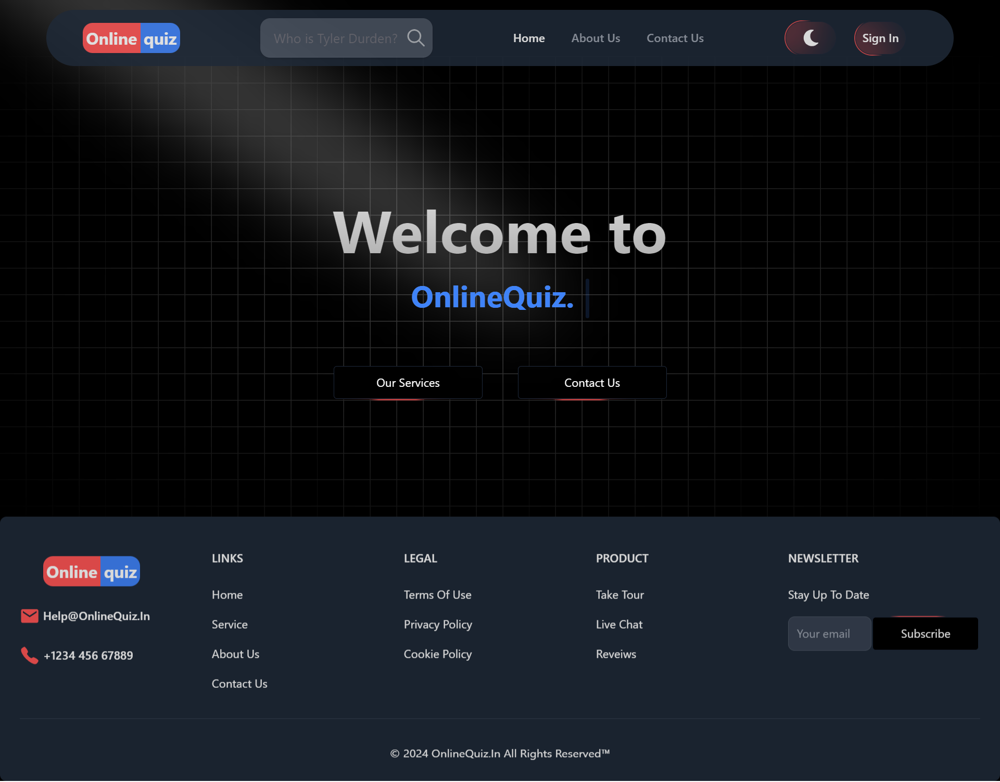
---
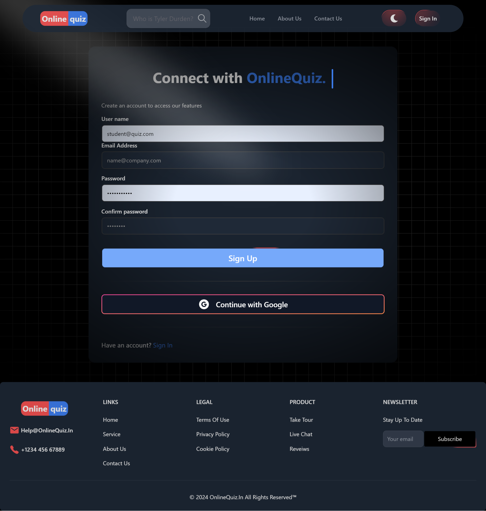
---
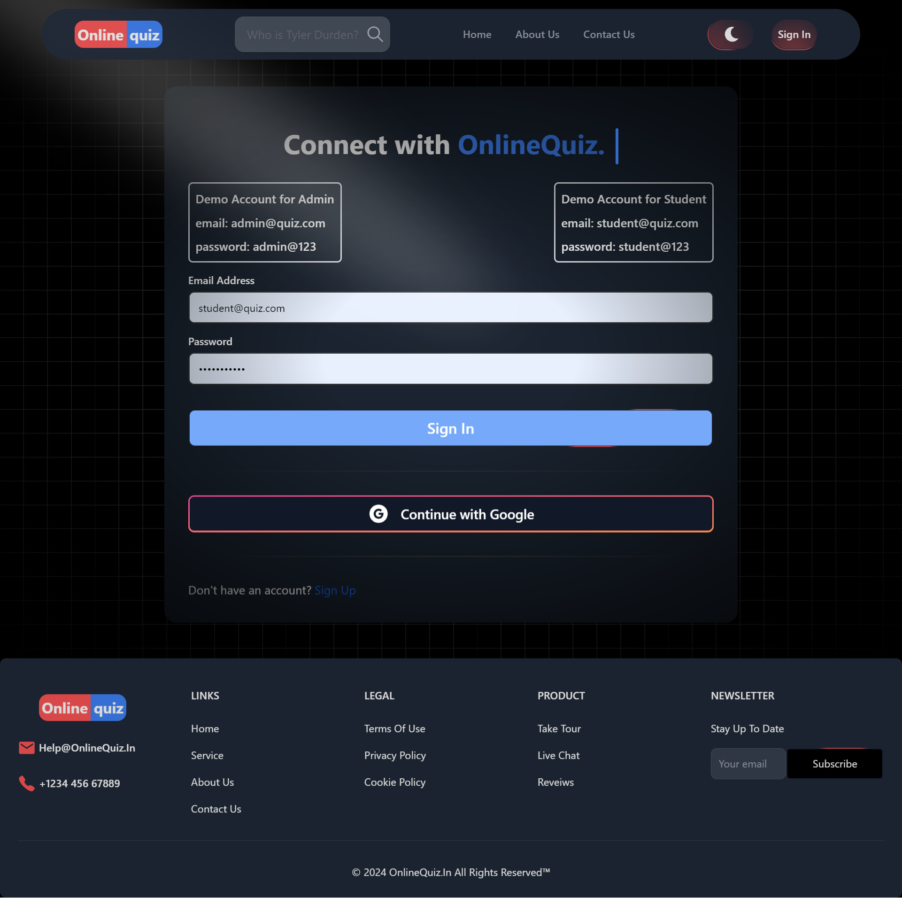
---
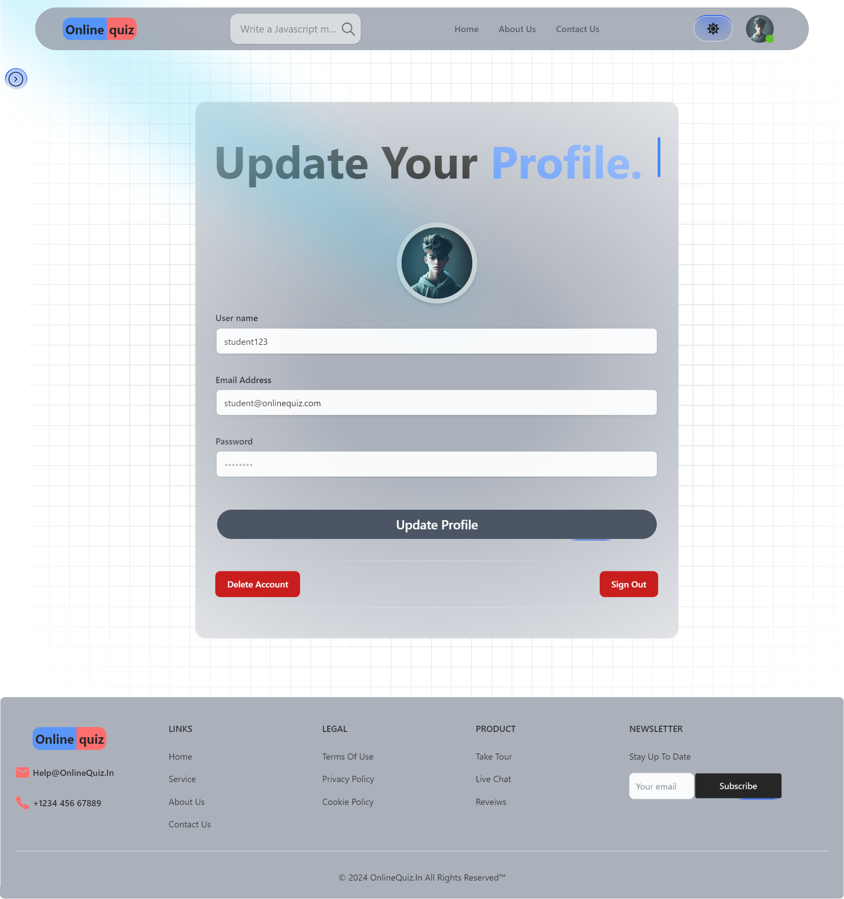
---
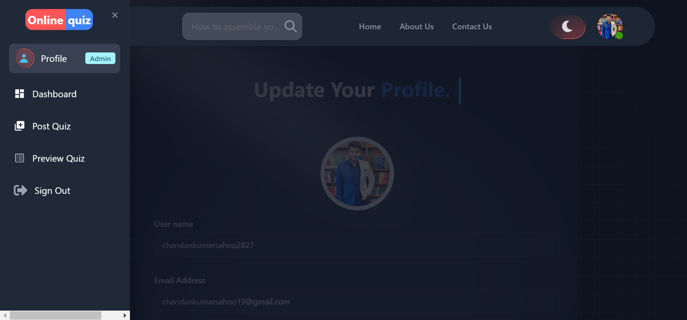
---
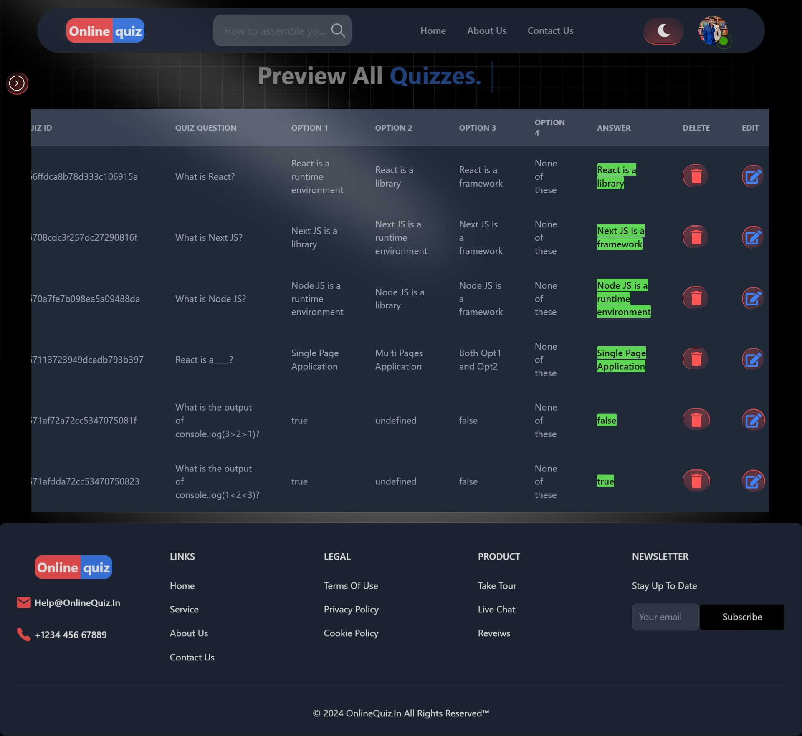
---
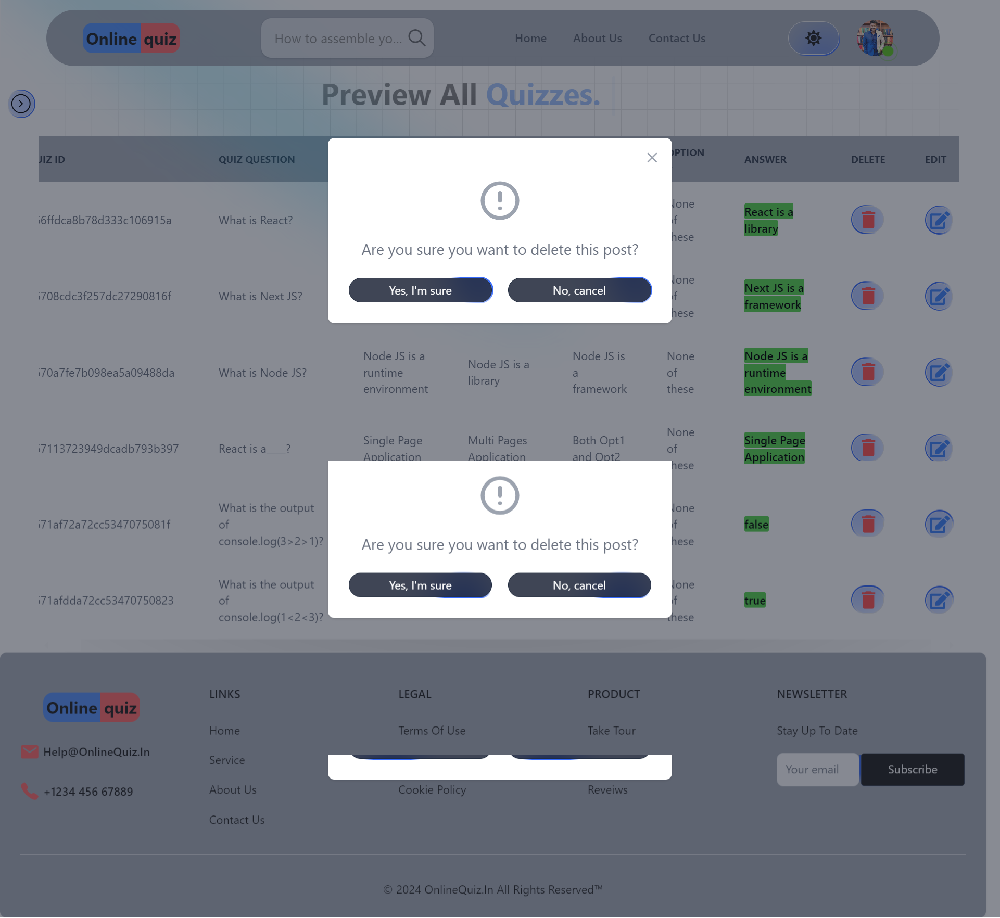
---
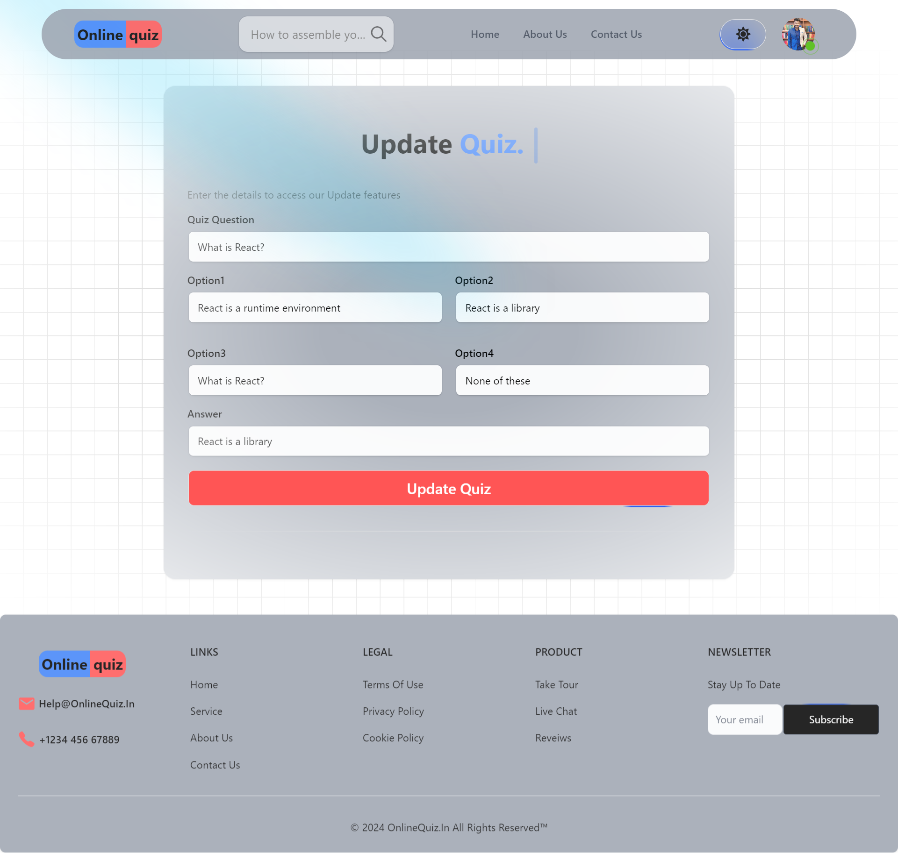
---
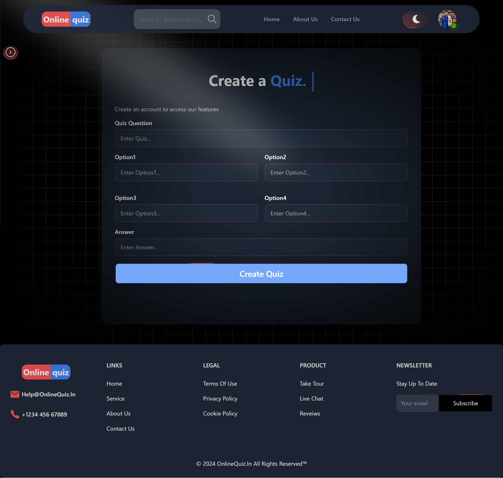
---
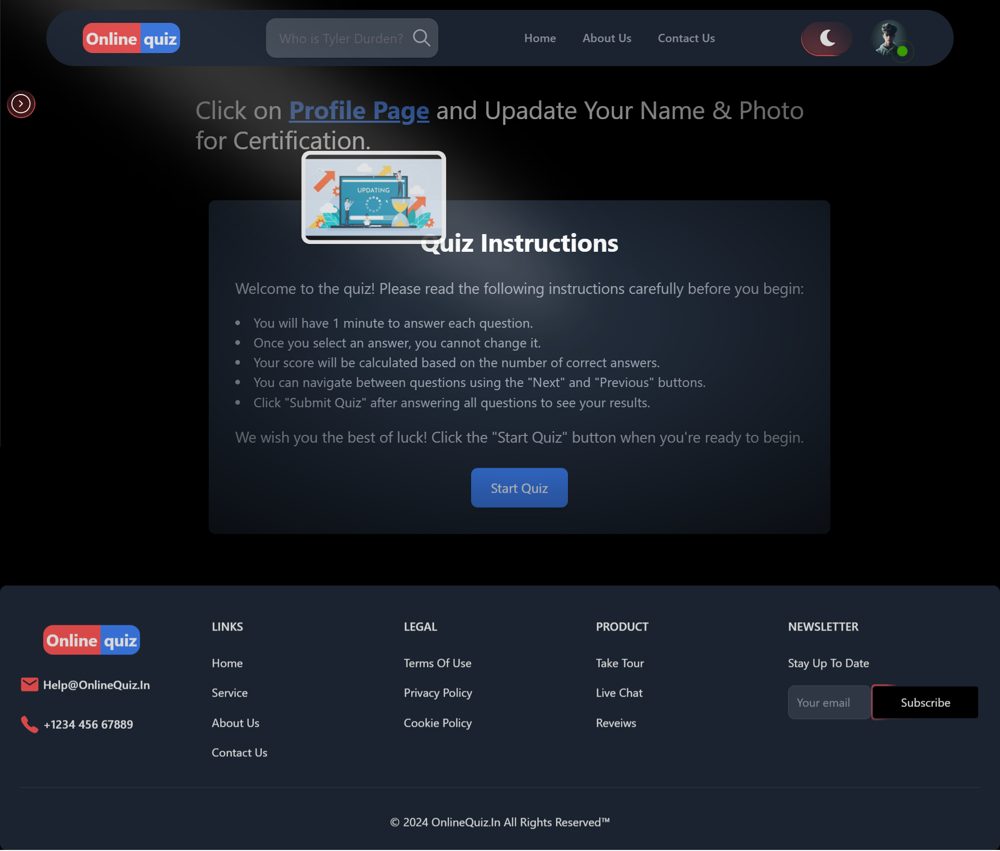
---
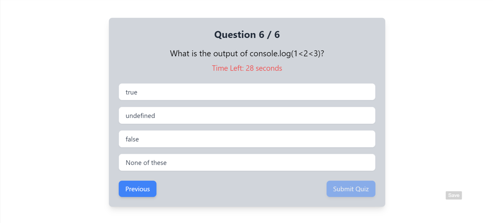
---
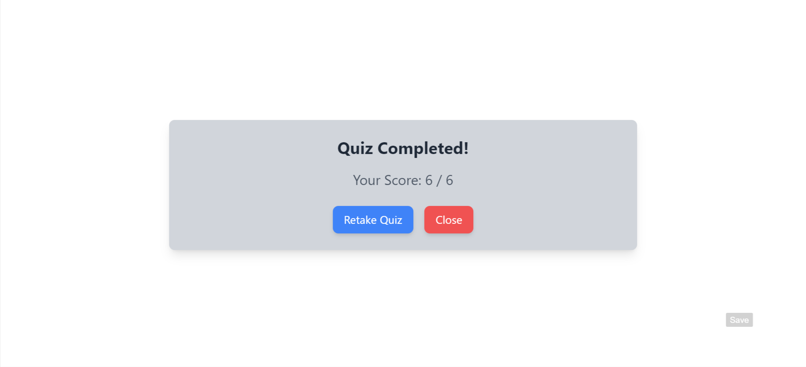
---


## Installation
1. **Clone the repository**:
    ```bash
    git clone https://github.com/Chandan8018/OnlineQuiz.git
    cd OnlineQuiz
    ```

2. **Backend Setup**:
    ```bash
    npm install
    ```

3. **Frontend Setup**:
    ```bash
    cd frontend
    npm install
    ```

4. **Environment Variables**:
    - Create a `.env` file in the root of the `api` directory and add your MongoDB URI, JWT secret, and other necessary environment variables.
    - Create a `.env` file in the root of the `frontend` directory and add your Firebase and other necessary environment variables.

## Usage
1. **Start the backend server**:
    ```bash
    npm run dev
    ```

2. **Start the frontend server**:
    ```bash
    cd frontend
    npm run dev
    ```

3. **Open your browser** and navigate to `http://localhost:7970` to view the application.

### Home Page

The Home Page is designed to welcome users with an attractive gradient background and interactive elements. It includes links to services and contact pages.

### Sign In / Sign Up

Users can sign in or register for a new account. These forms handle user input and manage state using Redux.

### Dashboard

Accessible only to authenticated users, the Dashboard displays user-specific information and actions.

## Folder Structure

```sh
.
├── api
|   ├── controllers
|   |   ├── auth.controller.js
|   |   ├── quiz.controller.js
|   |   └── user.controller.js 
|   ├── routes
|   |   ├── auth.route.js
|   |   ├── quiz.route.js
|   |   └── user.route.js
|   ├── models
|   |   ├── quiz.model.js
|   |   └── use.model.js
|   ├── utils
|   |   ├── error.js
|   |   └── verifyUser.js
|   └── index.js
|   
├── frontend
|   ├── public
|   ├── src
│   |   ├── components
│   │   |   ├── footer
│   │   │   |   └── FooterComp.jsx
│   │   |   ├── header
│   │   │   |   └── Header.jsx
│   │   |   ├── privateroute
│   │   │   |   └── PrivateRoute.jsx
│   │   |   ├── adminprivateroute
│   │   │   |   └── OnlyAdminPrivateRoute.jsx
│   │   |   ├── googleConfig
│   │   │   |   └── OAuth.jsx
│   │   |   ├── dash
│   │   │   |   ├── DashboardComp.jsx
|   |   |   |   ├── Profile.jsx  
|   |   |   |   ├── SideBarComp.jsx  
|   |   |   |   ├── SidebarIcons.jsx  
|   |   |   |   └── StudentDashboardComp.jsx  
│   │   |   ├── theme
│   │   │   |   └── ThemeProvider.jsx
│   │   |   ├── ui
│   │   │   |   └── Various UI Components
│   |   ├── pages
│   │   |   ├── About.jsx
│   │   |   ├── Contact.jsx
│   │   |   ├── Dashboard.jsx
│   │   |   ├── Home.jsx
│   │   |   ├── Service.jsx
│   │   |   ├── SignIn.jsx
│   │   |   ├── QuizPage.jsx
│   │   |   ├── UpdateQuiz.jsx
│   │   |   ├── PostQuiz.jsx
│   │   |   ├── ViewQuiz.jsx
│   │   |   └── SignUp.jsx
│   |   ├── redux
│   │   |   ├── theme
│   │   |   │   └── themeSlice.js
│   │   |   └── user
│   │   |       └── userSlice.js
│   |   ├── .env
│   |   ├── App.jsx
│   |   ├── main.jsx
│   |   ├── firebase.js
│   |   └── index.css
|   ├── .eslintrc.js
|   ├── .gitignore
|   ├── index.html
|   ├── package-lock.json
|   ├── package.json
|   ├── postcss.config.js
|   ├── tailwind.config.js
|   └── vite.config.js
├── .gitignore
├── package-lock.json
├── package.json
└── README.md
```
## License
This project is licensed under the MIT License. See the LICENSE file for details.
---
## Contact
For any questions or inquiries, please contact:

- Author: Chandan Kumar Sahoo
- Email: chandankumarsahoo19@gmail.com
- GitHub: https://github.com/Chandan8018/

Feel free to reach out for any questions, suggestions, or contributions. Happy coding!

